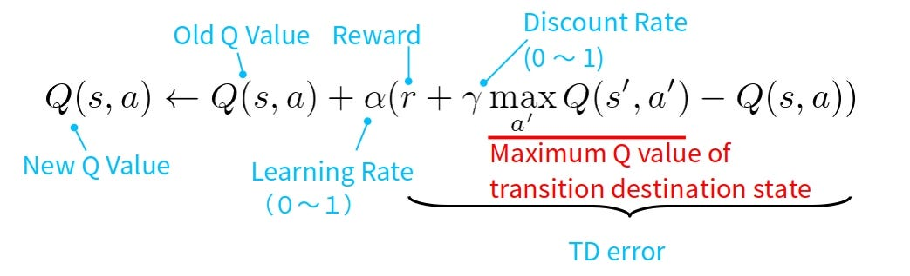
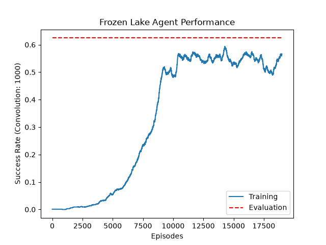

# Reinforcement Learning Agent in Gymnasium ❄️

## Technologies 💻
**Language:** Python

**Libraries:** NumPy, Matplotlib, Gymnasium, Pickle

## Overview ⚡
This project implements a Reinforcement Learning agent using tabular Q Learning to solve the Frozen Lake environment in Gymnasium.

The agent learns an optimal policy by iteratively updating a table of Q Values using the TD Bellman optimality update.

Training performance is tracked over time using episodic success rates, with results visualised as a learning curve showing convergence behaviour across training iterations.

A separate evaluation pipeline is used to measure final policy performance and compare against training dynamics.

The trained agent achieved an approximate 65% success rate over 2,000 evaluation episodes under stochastic dynamics.

The Q-table is persisted using Pickle and reused during evaluation for deterministic policy execution.

## Environment 🍃
[Official Gymnasium Documentation](https://gymnasium.farama.org/introduction/train_agent/)

- Enironment: FrozenLake
- Configuration: 8x8 grid Slippery Enabled 
- Objective: Navigate from start to goal without falling through the lake
- Dynamics: Stochastic movement 

[Further Readings](https://www.geeksforgeeks.org/machine-learning/q-learning-in-python/)
## Features 🧬
- Tabular Q Learning implementation from scratch
- ε-greedy exploration strategy with linear decay
- TD Bellman optimality equation Q-value updates
- Episodic success tracking during training
- Smoothing achieved through np.convolve for learning curve visualisation
- Model persistence using Pickle

## Performance 🎯

